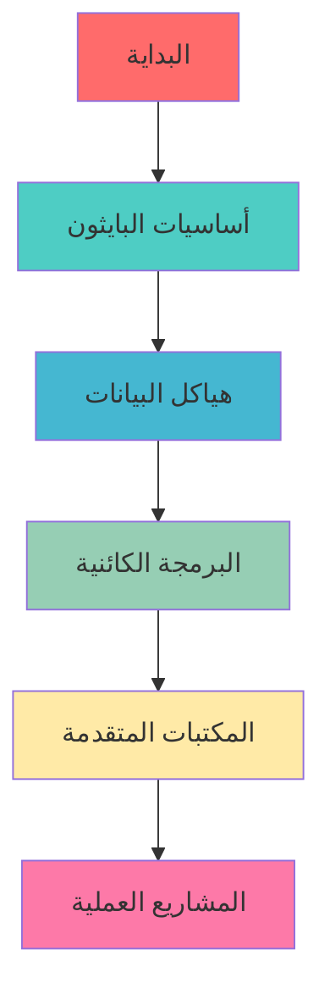

# 🐍 مصادر تعلم البايثون باللغة العربية
## Python Learning Resources in Arabic

<div align="center">


**دليلك الشامل لتعلم لغة البرمجة الأكثر شعبية في العالم**

</div>

---

## 📚 المصادر الرئيسية | Main Resources

### 🌟 الكتب الأساسية | Essential Books

#### 1. 📖 [كتاب تعلم البايثون](https://ahmedbouchefra.com/pybook)
- **الوصف**: كتاب شامل باللغة العربية لتعلم أساسيات البايثون
- **المستوى**: من المبتدئ إلى المتوسط
- **المحتوى**: 
  - أساسيات البرمجة
  - هياكل البيانات
  - البرمجة الكائنية
  - التعامل مع الملفات
  - المكتبات الأساسية

#### 2. 🤖 [Cody - مساعدك في البرمجة](https://ahmedbouchefra.com/cody)
- **الوصف**: دليل عملي للاستفادة من الذكاء الاصطناعي في البرمجة
- **التخصص**: البرمجة بمساعدة الذكاء الاصطناعي
- **الفوائد**:
  - تسريع عملية التطوير
  - حل المشاكل البرمجية
  - تحسين جودة الكود
  - التعلم التفاعلي

---

## 🎯 خارطة الطريق | Learning Path



---

## 📋 المحتويات التعليمية | Learning Content

### 🔰 المستوى الأول: الأساسيات

| الموضوع | الوصف | الوقت المقدر |
|---------|--------|-------------|
| 🏁 مقدمة البايثون | التعرف على اللغة وإعدادها | 2 ساعة |
| 🔢 المتغيرات والبيانات | أنواع البيانات الأساسية | 3 ساعات |
| ⚙️ العمليات والتحكم | الشروط والحلقات | 4 ساعات |
| 📝 الدوال | إنشاء واستخدام الدوال | 3 ساعات |

### 🔥 المستوى الثاني: المتوسط

| الموضوع | الوصف | الوقت المقدر |
|---------|--------|-------------|
| 📊 هياكل البيانات | القوائم، القواميس، المجموعات | 5 ساعات |
| 🏗️ البرمجة الكائنية | الكلاسات والكائنات | 6 ساعات |
| 📁 التعامل مع الملفات | قراءة وكتابة الملفات | 3 ساعات |
| 🐛 معالجة الأخطاء | Try/Except وأفضل الممارسات | 2 ساعة |

### ⚡ المستوى الثالث: المتقدم

| الموضوع | الوصف | الوقت المقدر |
|---------|--------|-------------|
| 🌐 تطوير الويب | Flask/Django | 15 ساعة |
| 📈 تحليل البيانات | Pandas, NumPy | 12 ساعة |
| 🤖 الذكاء الاصطناعي | مقدمة في Machine Learning | 20 ساعة |
| 🎮 واجهات المستخدم | Tkinter/PyQt | 10 ساعات |

---

## 🛠️ الأدوات المساعدة | Helpful Tools

### 💻 بيئات التطوير

<div align="center">

| الأداة | الوصف | التقييم |
|--------|--------|---------|
|  | بيئة تطوير متكاملة للمحترفين | ⭐⭐⭐⭐⭐ |
|  | محرر مرن ومجاني | ⭐⭐⭐⭐⭐ |
|  | مثالي لتحليل البيانات | ⭐⭐⭐⭐ |

</div>

### 🌐 المنصات التفاعلية

- **[Replit](https://replit.com)** - برمجة في المتصفح
- **[Google Colab](https://colab.research.google.com)** - مجاني مع دعم GPU
- **[GitHub Codespaces](https://github.com/features/codespaces)** - بيئة تطوير سحابية

---

## 📖 مصادر إضافية | Additional Resources

### 🎥 قنوات يوتيوب عربية

```
🎬 القنوات المقترحة:
├── 📺 أكاديمية حسونة
├── 📺 محمد الدسوقي
├── 📺 عبدالله عيد
└── 📺 مصطفى سعد
```

### 📱 تطبيقات الهاتف المحمول

| التطبيق | النظام | المميزات |
|---------|--------|----------|
| **Pydroid 3** | Android | مترجم كامل للأندرويد |
| **Pythonista** | iOS | بيئة قوية للآيفون |
| **SoloLearn** | Both | تعلم تفاعلي |

### 🌍 مواقع التدريب

<div align="center">

[](https://hackerrank.com)
[](https://leetcode.com)
[](https://codewars.com)

</div>

---

## 🏆 مشاريع للتطبيق | Practice Projects

### 🚀 مشاريع للمبتدئين

```python
# مشاريع مقترحة:
projects = [
    "🎲 لعبة تخمين الأرقام",
    "📊 حاسبة بسيطة", 
    "📝 مدير المهام",
    "🌡️ محول درجات الحرارة",
    "💰 حاسبة الراتب"
]
```

### ⚡ مشاريع متقدمة

- **🌐 تطبيق ويب للمدونة الشخصية**
- **📈 نظام إدارة المخزون**
- **🤖 بوت تيليجرام ذكي**
- **📊 تحليل بيانات المبيعات**
- **🎮 لعبة بسيطة باستخدام Pygame**

---

## 💡 نصائح للنجاح | Success Tips

<div align="center">

### 🎯 الممارسة اليومية

> **"البرمجة مهارة تتطلب الممارسة المستمرة"**

</div>

#### ✅ أفضل الممارسات:

- **🕒 خصص وقتاً يومياً**: 30 دقيقة على الأقل يومياً
- **💪 حل التمارين**: اعمل على مشكلة برمجية كل يوم
- **👥 انضم للمجتمعات**: شارك في المنتديات العربية
- **📖 اقرأ الكود**: تعلم من أكواد الآخرين
- **🔄 راجع وطور**: عد لمشاريعك القديمة وحسنها

---

## 🤝 المجتمع والدعم | Community & Support

### 💬 مجتمعات عربية

| المنصة | الرابط | المتابعين |
|--------|--------|-----------|
| **Discord** | [مجتمع المطورين العرب](https://discord.gg/arabdev) | 15K+ |
| **Telegram** | [@PythonArabic](https://t.me/PythonArabic) | 8K+ |
| **Facebook** | [مطوري بايثون العرب](https://facebook.com/groups/pythonarabic) | 25K+ |

### 📧 التواصل

- **البريد الإلكتروني**: support@pythonlearning.ar
- **تويتر**: [@PythonArabic](https://twitter.com/pythonarabic)

---

## 📊 إحصائيات التعلم | Learning Statistics

```python
learning_progress = {
    "الطلاب المسجلين": "10,000+",
    "الدروس المكتملة": "500,000+", 
    "معدل النجاح": "92%",
    "متوسط وقت التعلم": "3-6 أشهر",
    "رضا الطلاب": "4.8/5 ⭐"
}
```

---

## 🎖️ شهادات الإنجاز | Certificates

<div align="center">


**احصل على شهادة معتمدة بعد إكمال البرنامج التدريبي**

</div>

---

## 🆕 آخر التحديثات | Latest Updates

| التاريخ | التحديث |
|---------|---------|
| **2025-09-01** | إضافة فصل الذكاء الاصطناعي |
| **2025-08-15** | تحديث مكتبة Django |
| **2025-08-01** | إضافة تمارين جديدة |
| **2025-07-20** | تحسين واجهة المستخدم |

---

## 🚀 ابدأ رحلتك اليوم!

<div align="center">

[](https://ahmedbouchefra.com/pybook)

**من صفر إلى الاحتراف في 6 أشهر**

</div>

---

<div align="center">

### 🌟 النجاح يبدأ بخطوة واحدة

**شارك هذا المستودع مع أصدقائك المطورين** ⭐

[](https://github.com/username/repo)
[](https://github.com/username/repo)

---

**صُنع بـ ❤️ للمجتمع العربي**

*جميع الحقوق محفوظة © 2025*

</div>
