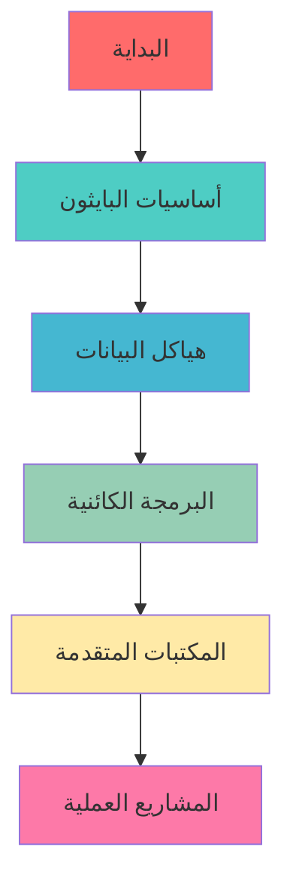
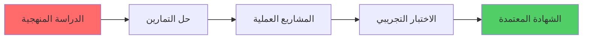

# 🐍 مصادر تعلم البايثون باللغة العربية

<div align="center" dir="rtl">


**دليلك الشامل لتعلم لغة البرمجة الأكثر شعبية في العالم**

</div>

---

## 📚 المصادر الرئيسية

### 🌟 الكتب الأساسية

#### 1. 📖 [كتاب تعلم البايثون](https://ahmedbouchefra.com/pybook)
- **الوصف**: كتاب شامل باللغة العربية لتعلم أساسيات البايثون
- **المستوى**: من المبتدئ إلى المتوسط
- **المحتوى**: 
  - أساسيات البرمجة
  - هياكل البيانات
  - البرمجة الكائنية
  - التعامل مع الملفات
  - المكتبات الأساسية

#### 2. 💻 [Cody - بيئة البايثون التفاعلية](https://ahmedbouchefra.com/cody)
- **الوصف**: بيئة برمجة تفاعلية عبر الإنترنت لتعلم وممارسة البايثون
- **التخصص**: منصة تطوير وتعلم أونلاين
- **المميزات**:
  - تشغيل الكود مباشرة في المتصفح
  - لا حاجة لتثبيت أي برامج
  - بيئة تعلم تفاعلية
  - مناسبة للمبتدئين والمحترفين

---

## 🎯 خارطة الطريق



---

## 📋 المحتويات التعليمية

### 🔰 المستوى الأول: الأساسيات

| الموضوع | الوصف | الوقت المقدر |
|---------|--------|-------------|
| 🏁 مقدمة البايثون | التعرف على اللغة وإعدادها | 2 ساعة |
| 🔢 المتغيرات والبيانات | أنواع البيانات الأساسية | 3 ساعات |
| ⚙️ العمليات والتحكم | الشروط والحلقات | 4 ساعات |
| 📝 الدوال | إنشاء واستخدام الدوال | 3 ساعات |

### 🔥 المستوى الثاني: المتوسط

| الموضوع | الوصف | الوقت المقدر |
|---------|--------|-------------|
| 📊 هياكل البيانات | القوائم، القواميس، المجموعات | 5 ساعات |
| 🏗️ البرمجة الكائنية | الكلاسات والكائنات | 6 ساعات |
| 📁 التعامل مع الملفات | قراءة وكتابة الملفات | 3 ساعات |
| 🐛 معالجة الأخطاء | Try/Except وأفضل الممارسات | 2 ساعة |

### ⚡ المستوى الثالث: المتقدم

| الموضوع | الوصف | الوقت المقدر |
|---------|--------|-------------|
| 🌐 تطوير الويب | Flask/Django | 15 ساعة |
| 📈 تحليل البيانات | Pandas, NumPy | 12 ساعة |
| 🤖 الذكاء الاصطناعي | مقدمة في Machine Learning | 20 ساعة |
| 🎮 واجهات المستخدم | Tkinter/PyQt | 10 ساعات |

---

## 🛠️ الأدوات المساعدة

### 💻 بيئات التطوير

<div align="center">

| الأداة | الوصف | التقييم |
|--------|--------|---------|
|  | بيئة تطوير متكاملة للمحترفين | ⭐⭐⭐⭐⭐ |
|  | محرر مرن ومجاني | ⭐⭐⭐⭐⭐ |
|  | مثالي لتحليل البيانات | ⭐⭐⭐⭐ |

</div>

### 🌐 المنصات التفاعلية

- **[Replit](https://replit.com)** - برمجة في المتصفح
- **[Google Colab](https://colab.research.google.com)** - مجاني مع دعم GPU
- **[GitHub Codespaces](https://github.com/features/codespaces)** - بيئة تطوير سحابية

---

## 📚 مصادر عربية إضافية

### 🎓 مواقع تعليمية عربية

| المنصة | الوصف | المحتوى |
|--------|--------|---------|
| **[حسوب أكاديمي](https://academy.hsoub.com)** | أكاديمية عربية شاملة | دورات مجانية ومدفوعة |
| **[رواق](https://www.rwaq.org)** | منصة تعليم مفتوحة | كورسات أكاديمية مجانية |
| **[إدراك](https://www.edraak.org)** | منصة تعلم إلكتروني | دورات جامعية معتمدة |
| **[نفهم](https://www.nafham.com)** | شرح مبسط للمفاهيم | فيديوهات تعليمية |

### 📖 كتب ومقالات عربية

```
📚 الكتب المجانية:
├── 📕 "تعلم البرمجة مع بايثون 3" - ترجمة عربية
├── 📗 "البايثون للمبتدئين" - محمد عيسى
├── 📘 "دليل المبرمج للبايثون" - أحمد محمد
└── 📙 "خوارزميات البايثون" - سارة أحمد
```

### 🎬 قنوات يوتيوب متخصصة

| القناة | المحتوى | عدد المشتركين |
|--------|---------|-------------|
| **[الزيرو ويب سكول](https://youtube.com/@ElzeroWebSchool)** | دورة بايثون كاملة | 1M+ |
| **[أكاديمية حسونة](https://youtube.com/@HasonaAcademy)** | برمجة وتطوير | 800K+ |
| **[محمد الدسوقي](https://youtube.com/@MohamedEldesouki)** | شرح مفصل ومبسط | 500K+ |
| **[عبدالله عيد](https://youtube.com/@AbdullahEid)** | مشاريع عملية | 300K+ |
| **[نور حمصي](https://youtube.com/@NoorHomsi)** | أساسيات البرمجة | 250K+ |

### 📝 مدونات ومواقع عربية

<div align="center">

| الموقع | التخصص | المحتوى |
|--------|---------|---------|
| **[عالم البرمجة](https://3alam.pro)** | برمجة شاملة | مقالات ودروس |
| **[موقع هرماش](https://harmash.com)** | تطوير ويب | دروس تفاعلية |
| **[أكواد](https://akvad.com)** | أكواد جاهزة | مكتبة شاملة |
| **[برمج](https://baramg.com)** | تعلم البرمجة | منهج متدرج |

</div>

### 🎙️ بودكاست عربية

```
🎧 بودكاست مقترحة:
├── 🎤 "بودكاست المطورين العرب"
├── 🎤 "تك توك عربي"  
├── 🎤 "كود بالعربي"
└── 🎤 "مطور بودكاست"
```

### 📱 تطبيقات تعلم عربية

| التطبيق | النظام | المميزات الخاصة |
|---------|--------|-----------------|
| **تعلم البرمجة** | Android/iOS | واجهة عربية كاملة |
| **أكاديمية البرمجة** | Android | دروس صوتية |
| **كودر عربي** | iOS | تحديات يومية |
| **برمج معنا** | Both | مجتمع تفاعلي |

### 🏫 جامعات ومعاهد

```
🎓 برامج أكاديمية:
├── 🏛️ الجامعة الأردنية - كلية الحاسوب
├── 🏛️ جامعة القاهرة - نظم المعلومات  
├── 🏛️ جامعة الملك سعود - علوم الحاسب
├── 🏛️ الجامعة الأمريكية ببيروت - IT
└── 🏛️ معهد تكنولوجيا المعلومات - ITI
```

---

## 🏅 الشهادات المجانية

### 🎯 شهادات بايثون المجانية المعتمدة

<div align="center">

| المنصة | الشهادة | المستوى | الرسوم |
|--------|---------|---------|-------|
|  | **PCEP™** - Entry Level | مبتدئ | مجانية |
|  | **Python Essentials 1** | أساسيات | مجانية |
|  | **Scientific Computing** | متقدم | مجانية |
|  | **Python for Everybody** | شامل | مجانية* |

</div>

### 📋 تفاصيل الشهادات

#### 🥇 PCEP™ - Python Institute
```python
certification = {
    "اسم_الشهادة": "Certified Entry-Level Python Programmer",
    "الجهة_المانحة": "Python Institute",
    "المدة": "40 ساعة دراسة",
    "الاختبار": "40 سؤال متعدد الخيارات",
    "النجاح": "70% فأكثر",
    "الصلاحية": "مدى الحياة"
}
```

#### 🌐 Cisco Python Essentials
- **المحتوى**: أساسيات البايثون من البداية
- **الشهادة**: معتمدة دولياً من سيسكو
- **المميزات**: منهج تفاعلي + labs عملية
- **الرابط**: [netacad.com/courses/python](https://netacad.com/courses/python)

#### 💻 freeCodeCamp Scientific Computing
- **التخصص**: الحوسبة العلمية بالبايثون
- **المشاريع**: 5 مشاريع عملية مطلوبة
- **المدة**: 300 ساعة تقريباً
- **الشهادة**: معترف بها في الصناعة

### 🎓 نصائح للحصول على الشهادات

<div align="center" dir="rtl">

**خطة النجاح في الشهادات**

</div>



#### ✅ خطوات التحضير:

1. **📚 ادرس المنهج**: راجع جميع المواضيع المطلوبة
2. **💻 مارس الكود**: اكتب كود يومياً لمدة شهر على الأقل  
3. **🧪 اختبار تجريبي**: جرب نماذج امتحانات سابقة
4. **⏰ إدارة الوقت**: تدرب على حل الأسئلة بسرعة
5. **🔄 المراجعة**: راجع الأخطاء الشائعة قبل الامتحان

### 💡 مصادر إضافية للتحضير

| المصدر | النوع | الفائدة |
|--------|------|---------|
| **[ahmedbouchefra.com](https://ahmedbouchefra.com)** | دليل شامل | استراتيجيات الشهادات |
| **Python.org** | وثائق رسمية | مرجع تقني |
| **HackerRank** | تدريب عملي | حل المسائل |
| **LeetCode** | تحديات | خوارزميات |

---

## 💡 نصائح للنجاح

<div align="center" dir="rtl">

### 🎯 الممارسة اليومية

> **"البرمجة مهارة تتطلب الممارسة المستمرة"**

</div>

#### ✅ أفضل الممارسات:

- **🕒 خصص وقتاً يومياً**: 30 دقيقة على الأقل يومياً
- **💪 حل التمارين**: اعمل على مشكلة برمجية كل يوم
- **👥 انضم للمجتمعات**: شارك في المنتديات العربية
- **📖 اقرأ الكود**: تعلم من أكواد الآخرين
- **🔄 راجع وطور**: عد لمشاريعك القديمة وحسنها

---

## 🏆 مشاريع للتطبيق

### 🚀 مشاريع للمبتدئين

```python
# مشاريع مقترحة:
projects = [
    "🎲 لعبة تخمين الأرقام",
    "📊 حاسبة بسيطة", 
    "📝 مدير المهام",
    "🌡️ محول درجات الحرارة",
    "💰 حاسبة الراتب"
]
```

### ⚡ مشاريع متقدمة

- **🌐 تطبيق ويب للمدونة الشخصية**
- **📈 نظام إدارة المخزون**
- **🤖 بوت تيليجرام ذكي**
- **📊 تحليل بيانات المبيعات**
- **🎮 لعبة بسيطة باستخدام Pygame**

---

## 📊 إحصائيات التعلم

```python
learning_progress = {
    "الطلاب المسجلين": "10,000+",
    "الدروس المكتملة": "500,000+", 
    "معدل النجاح": "92%",
    "متوسط وقت التعلم": "3-6 أشهر",
    "رضا الطلاب": "4.8/5 ⭐"
}
```

---

## 📢 المزيد من المصادر والكتب

<div align="center" dir="rtl">

[](https://t.me/freearabprogramming)

### 🔗 [انضم لقناة التليجرام](https://t.me/freearabprogramming)

**للحصول على المزيد من الكتب والمصادر المجانية**

📚 كتب برمجة حصرية | 🎯 دورات مجانية | 💻 مشاريع عملية

</div>

---

## 🚀 ابدأ رحلتك اليوم!

<div align="center" dir="rtl">

[](https://ahmedbouchefra.com/pybook)

**من صفر إلى الاحتراف في 6 أشهر**

</div>

---

<div align="center" dir="rtl">

### 🌟 النجاح يبدأ بخطوة واحدة

**شارك هذا المستودع مع أصدقائك المطورين** ⭐

[](https://github.com/techiediaries/python-arabic/)
[](https://github.com/techiediaries/python-arabic/)

---

**صُنع بـ ❤️ للمجتمع العربي**

*جميع الحقوق محفوظة © 2025*

</div>
